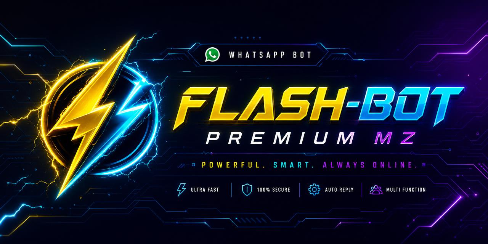

# ⚡ FLASH-BOT V6.2 — PREMIUM MZ

<p align="center">
  
</p>

<p align="center">
  <b>⚡ Velocidade. Inteligência. Domínio.</b><br>
  <i>by <a href="https://wa.me/258848881576">thebest</a> • MOZ BOTS 2026</i>
</p>

<p align="center">
  
  
  
  
</p>

---

## 🔥 O QUE É O FLASH-BOT?

**FLASH-BOT V6.2** é o bot de WhatsApp mais completo de Moçambique. Construído sobre Baileys, com **mais de 90 comandos canónicos** e **400+ aliases**, IA Gemini integrada, vendas de megas com detecção automática de comprovativos M-Pesa/eMola/Mola, sistema de aluguel por código, antis em 3 níveis interactivos, jogos inteligentes, downloads YouTube, pesquisa Google (texto e imagens), e muito mais.

> ❝ Pensado para ser bizarro. Construído para ser intocável. ❞

---

## 🎯 DESTAQUES

<table>
<tr>
<td width="50%">

### 👑 Dono Supremo Intocável
- Definido na primeira conexão via **LID**
- O bot **nunca** te bani, mute ou pune
- Promove-se automaticamente se precisar
- Sub-donos com acesso parcial

### 💰 Sistema de Vendas Completo
- Tabela de megas (diário/semanal/mensal)
- `.compra`, `.confirmar`, `.vendas`, `.totalvendas`
- **Detecção automática** de comprovativos
- Pareamento valor ↔ pacote

</td>
<td width="50%">

### 🛡️ Antis com 3 Níveis
- **N1:** Apaga em silêncio
- **N2:** Apaga + avisa (ban após X avisos)
- **N3:** Apaga + bani imediatamente
- Tipos: link, sticker, audio, video, doc, fake, flood

### 🧠 IA Gemini Real
- Conhece-se a si próprio, ao criador e ao dono
- Modo `.interact` para responder sem prefixo
- `.ensinar` para criar base de conhecimento

</td>
</tr>
<tr>
<td width="50%">

### 🎮 Jogos Inteligentes
- Jogo da velha em 3 níveis (minimax)
- Adivinha número, filme, anime, música
- PPT, dado, roleta
- Tabuleiros bonitos

### 🔑 Sistema de Aluguel
- `.gencode 3d 2` — gera código (3 dias, 2 usos)
- `.resgatar` — activa grupo
- **5 erros = grupo bloqueado**
- `.unblockcode` para desbloquear

</td>
<td width="50%">

### 🎵 Downloads & Media
- YouTube MP3/MP4 (`ytmp3`, `ytmp4`, `play`)
- TTS com voz Vitória
- Google search (texto + 5 imagens)
- Stickers, conversão

### 🎨 Personalização Total
- 5 estilos de fonte aplicados em **todas** as mensagens
- Foto de menu, welcome
- Auto-respostas com variáveis
- Reactions em todos os comandos

</td>
</tr>
</table>

---

## 📱 INSTALAÇÃO NO TERMUX

O FLASH-BOT corre 100% no teu telemóvel via Termux. Sem servidor, sem renderização externa.

### 1️⃣ Dá permissão ao Termux para acessar o armazenamento

```bash
termux-setup-storage
```

### 2️⃣ Atualiza os pacotes

```bash
pkg update -y && pkg upgrade -y
```

### 3️⃣ Instala as dependências do sistema

```bash
pkg install -y nodejs git ffmpeg
```

### 4️⃣ Clona o repositório

```bash
git clone https://github.com/thebest-dev087/FLASH-BOT.git
```

### 5️⃣ Entra na pasta

```bash
cd FLASH-BOT
```

### 6️⃣ Instala as dependências Node

```bash
npm install
```

### 7️⃣ (Opcional) Configura a chave Gemini para a IA

Abre `config.js` e cola a tua chave em `ai.apiKey`:

```bash
nano config.js
```

Obtém uma chave grátis em https://aistudio.google.com/app/apikey

### 8️⃣ Inicia o bot

```bash
npm start
```

> 🌟 Vais ver o banner ASCII **FLASH-BOT** gigante. O bot vai perguntar se queres conectar por **Código de Pareamento** ou **QR Code**. Escolhe!

---

## 👑 COMO SER DONO SUPREMO

Logo na primeira conexão, o bot envia-te uma mensagem no PV do próprio número.

```
1. Vai ao WhatsApp do número que ligaste ao bot.
2. Abre a conversa "FLASH-BOT".
3. Escreve: .lid
   → O bot mostra o teu LID.
4. Sem prefixo, escreve: flash <teu_lid>
5. O bot pergunta como queres ser chamado. Diz só o nome.
6. Escreve: .salvar
```

✅ **Pronto.** Tu agora és o Dono Supremo. **Intocável.**

> 💡 Podes também usar OUTRA conta como dono: entra num grupo com essa conta, usa `.lid` lá, copia o LID, e segue o guia acima no PV.

---

## 💰 COMO VENDER MEGAS

```
.tabela           → vê todos os pacotes
.pagamento        → vê M-Pesa / eMola / Mola
.compra 1024      → cliente compra 1024MB
.confirmar 1      → admin confirma a venda #1
.vendas           → vê vendas de hoje
.vendasdia 25/12  → vê vendas de uma data
.totalvendas      → total geral facturado
```

Quando alguém envia um comprovativo M-Pesa/eMola/Mola, o bot **detecta automaticamente** o ID, valor, e pacote correspondente. Se a IA estiver activa (`.interact on`), ela própria fala com o cliente!

---

## 🛡️ COMO USAR OS ANTIS

```
.antilink         → mostra info + escolhe nível
.antilink 1       → nível 1 (silêncio)
.antilink 2       → nível 2 (avisa) — pergunta quantos avisos
.antilink 3       → nível 3 (ban directo)
.antilink off     → desliga
.statusantis      → vê todos
```

Aplica-se também a: `.antisticker`, `.antiaudio`, `.antivideo`, `.antidoc`, `.antifake`, `.antiflood`.

---

## 🔑 SISTEMA DE ALUGUEL

```
.modo rental                  # activa modo aluguel (só dono)
.gencode 3d 2                 # gera código (3 dias, 2 utilizadores)
.resgatar FB-XXXXXXXX         # cliente activa o grupo
.unblockcode <jid_grupo>      # dono gera código de desbloqueio
.desbloquear UNL-XXXXX        # admin desbloqueia grupo bloqueado
```

> ⚠ **5 códigos errados = grupo bloqueado.** Só o dono pode emitir o desbloqueio.

---

## 🎮 JOGOS

```
.jdv 1            # jogo da velha — fácil
.jdv 2            # médio
.jdv 3            # imbatível (minimax puro)
.adivinha         # número entre 1-100
.ppt pedra        # pedra papel tesoura
.adivinhafilme    # quiz filme
.adivinhaanime    # quiz anime
.roleta           # sorte
.dado             # 1-6
```

---

## 📂 ESTRUTURA DO PROJECTO

```
FLASH-BOT/
├── index.js              # entry — banner, login, conexão
├── handler.js            # router principal
├── config.js             # config central
├── lib/
│   ├── logger.js         # banner ASCII bonito
│   ├── db.js             # persistência JSON
│   ├── messages.js       # templates com fontes
│   ├── fonts.js          # 5 estilos Unicode
│   ├── menus.js          # menus com imagens
│   ├── aliases.js        # 400+ aliases
│   ├── permissions.js    # dono/admin
│   ├── antis.js          # 3 níveis interactivos
│   ├── detector.js       # M-Pesa/eMola/Mola
│   ├── sales.js          # vendas + tabela
│   ├── aluguel.js        # códigos + bloqueio
│   ├── welcome.js        # boas-vindas com foto
│   ├── games.js          # 6+ jogos
│   ├── ia.js             # Gemini + base conhecimento
│   ├── google.js         # search texto + imagens
│   ├── ytdl.js           # downloads YT
│   ├── reactions.js      # reactions automáticas
│   └── vcard.js          # cartão do criador
├── media/                # imagens dos menus
└── database/             # JSONs auto-gerados
```

---

## 🎨 PERSONALIZAÇÃO

```
.setfont fancy          # muda fonte (todas as mensagens!)
.listfonts              # vê todos os estilos
.setprefix !            # muda prefixo
.setdefaultreact ❄️💧🌀  # muda emojis de reaction
.setwelcome <texto>     # muda mensagem de boas-vindas
.bemvindo status        # vê status do welcome
```

**Variáveis disponíveis** (em welcome e auto-respostas):
- `@user` — menção
- `{group}` — nome do grupo
- `{count}` — número de membros
- `{bot}` — nome do bot
- `{data}` — data actual
- `{hora}` — hora actual
- `{name}` — nome do utilizador

---

## 🤖 IA

```
.ia <pergunta>             # pergunta directa
.ia                        # bot pede a pergunta
.ensinar X = Y             # ensina base de conhecimento
.esquecer X                # remove
.interact on               # responde sem prefixo no PV
.google <termo>            # pesquisa Google
.gimg <termo>              # 5 imagens Google
```

A IA conhece o bot, o criador, o dono, sabe vender megas, e responde em Português de Moçambique.

---

## 📞 SUPORTE & CONTACTO

<table>
<tr>
<td><b>Criador</b></td>
<td><a href="https://wa.me/258848881576">thebest — wa.me/258848881576</a></td>
</tr>
<tr>
<td><b>Repositório</b></td>
<td><a href="https://github.com/thebest-dev087/FLASH-BOT">github.com/thebest-dev087/FLASH-BOT</a></td>
</tr>
<tr>
<td><b>Grupo</b></td>
<td>MOZ BOTS 2026</td>
</tr>
</table>

---

## 📜 LICENÇA

MIT. Feito com ⚡ e ❤️ por **thebest** em **Moçambique 🇲🇿**.

> *"Comandos não são apenas funções. São extensões da tua vontade."*
> — FLASH-BOT V6.2
